


# 0. Setup

## Prerequisites

- Github repository with the source code to deploy
- Enterprise DC/OS cluster (1.8 or greater)
  - TODO: for now assuming that marathon-lb is already installed but could also include steps for deploying it through Spinnaker
  - The security mode for the cluster should be `permissive`. `strict` may work but has not been verified yet.
  - For the examples in this codelab we'll say that it's at `https://dcos.example.com` so you should replace that with the URL to your cluster
- Jenkins instance
  - This can be installed on your DC/OS cluster as a [Mesosphere Universe package](https://docs.mesosphere.com/service-docs/jenkins/)
- Spinnaker
  - Instructions for deploying Spinnaker on DC/OS are not yet published so in the meantime, refer to one of the [other Spinnaker deployment methods](https://spinnaker.github.io/setup/quickstart/)
  - TODO: Halyard setup

## Configure Spinnaker

### Manual

#### clouddriver-local.yml

```yml
dcos:
  enabled: true
  clusters:
    - name: codelab-cluster
      dcosUrl: https://dcos.example.com
      insecureSkipTlsVerify: true
  accounts:
    - name: codelab-dcos-account
      dockerRegistries:
        - accountName: your-docker-registry
      clusters:  
        - name: codelab-cluster
          uid: ${DCOS_USER}
          password: ${DCOS_PASSWORD}
dockerRegistry:
  enabled: true
  accounts:
  - name: your-docker-registry
    address: https://index.docker.io
    repositories:
    - lwander/spin-kub-demo
    username: ${DOCKER_USER}
    password: ${DOCKER_PASSWORD}
```

### Halyard  

If you've deployed your Spinnaker instance with Halyard, configuring Spinnaker requires the following steps.

#### Enable Docker

[Configure a docker registry with halyard](https://spinnaker.github.io/setup/providers/docker-registry/)

#### Set up the DC/OS provider

First, enable the provider:

```bash
hal config provider dcos enable
```  

Next we need to add our DC/OS cluster:

```bash
hal config provider dcos cluster add codelab-cluster \
    --dcos-url $CLUSTER_URL \
    --skip-tls-verify # For simplicity we won't worry about the
    # certificate for the cluster but this would not be recommended
    # for a real deployment
```

Create a Spinnaker account that has credentials for the cluster.

```bash
hal config provider dcos account add codelab \
    --cluster codelab-cluster \
    --docker-registries your-docker-registry
    --uid $DCOS_USER
    --password $DCOS_PASSWORD
```

* Note: Make sure that your DC/OS user has permission to deploy applications under a `/codelab` group in Marathon

And deploy the config with `hal`

```bash
sudo hal deploy apply
```

# 1. Create a Spinnaker Application

Spinnaker applications are groups of resources managed by the underlying cloud provider, and are delineated by the naming convention `<app name>-`.

Under the _Actions_ dropdown select _Create Application_ and fill out the following dialog:


You'll notice that you were dropped in this _Clusters_ tab for your newly created application. In Spinnaker's terminology a _Cluster_ is a collection of _Server Groups_ all running different versions of the same artifact (Docker Image). Furthermore, _Server Groups_ are DC/OS  [Services](https://docs.mesosphere.com/1.9/deploying-services/creating-services/)

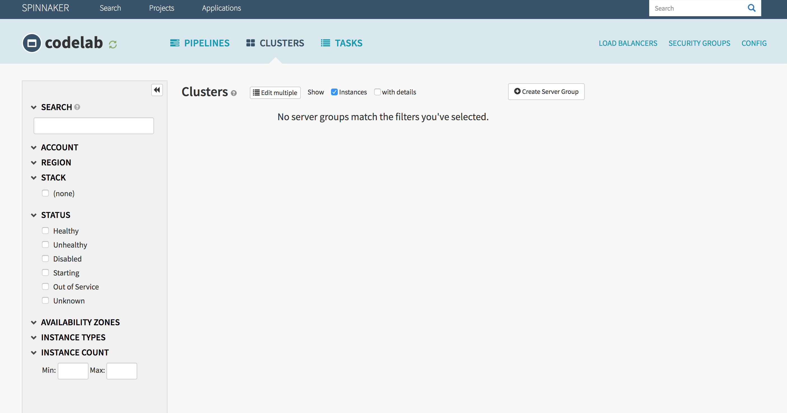

# 2. Create a Demo Server Group

Next we will create a _Server Group_ as a sanity check to make sure we have set up everything correctly so far. Before doing this, ensure you have at least 1 tag pushed to your Docker registry with the code you want to deploy. Now on the _Clusters_ screen, select _Create Server Group/Job_, choose _Server Group_ from the drop down and hit _Next_ to see the following dialog:


Fill out the basic settings and select your Docker image to use.


Select the Bridge network type and the port that the process in the container will listen on.

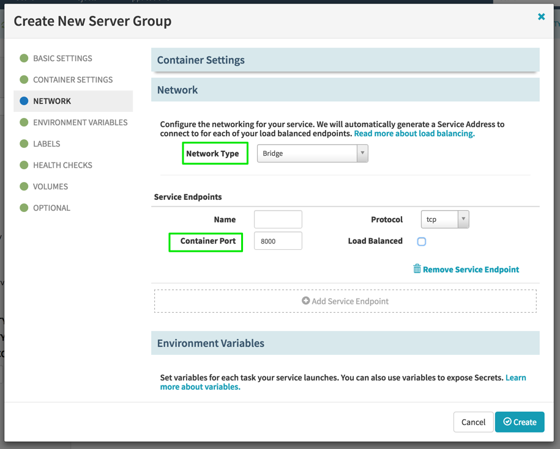

Add the labels that marathon-lb will use to route traffic to your instance.

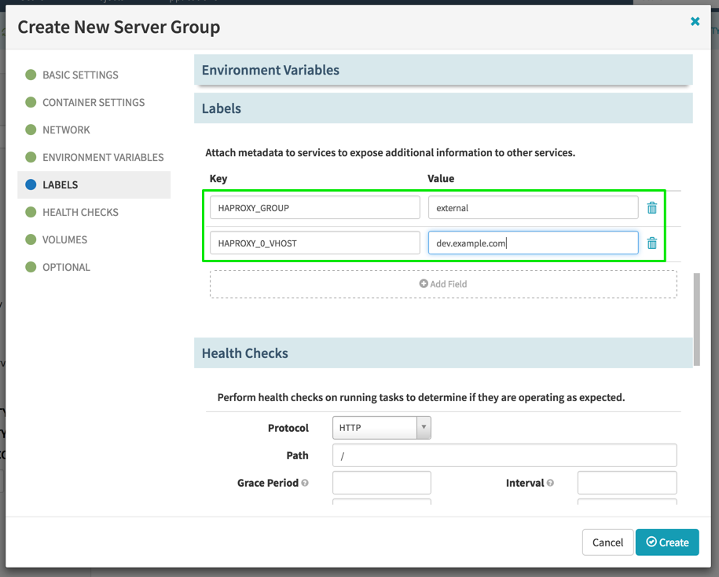

Finally, add a health check and then click Create.

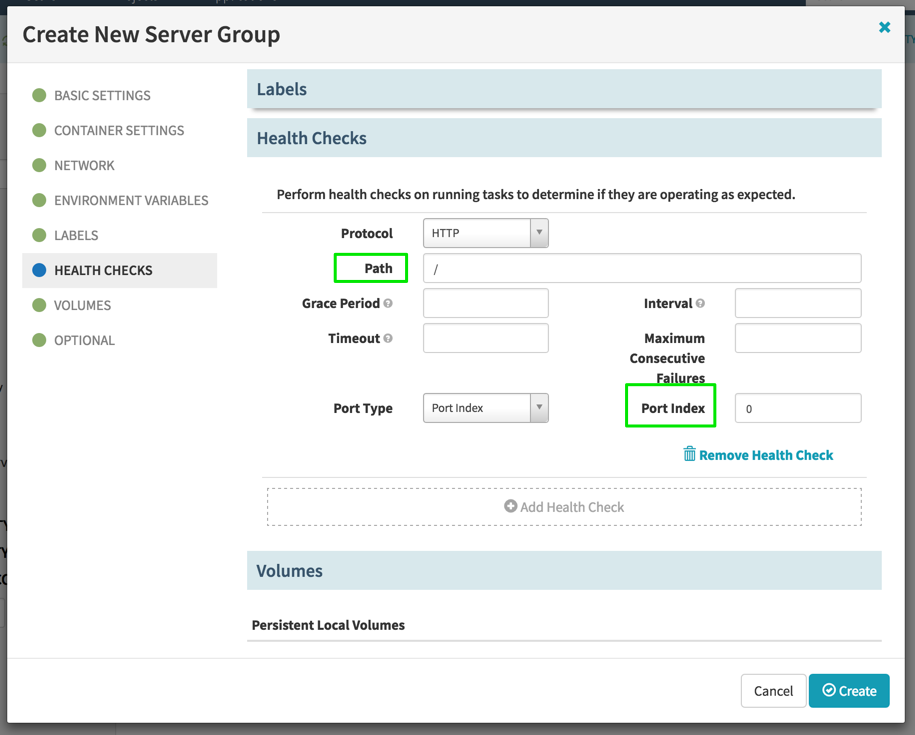

Test that you can reach your service with the following command (where `$VHOST` is the `HAPROXY_0_VHOST` value from your server group)

```bash
curl --header "Host: dev.example.com" http://$PUBLIC_AGENT
```

# 3. Git to _dev_ Pipeline

Now let's automate the process of creating server groups associated with the _dev_ stack. Navigate to the _Pipelines_ tab, select _Configure_ > _Create New..._ and then fill out the resulting dialog as follows:

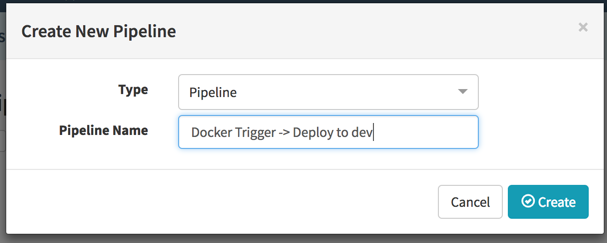

In the resulting page, select _Add Trigger_, and fill the form out as follows:

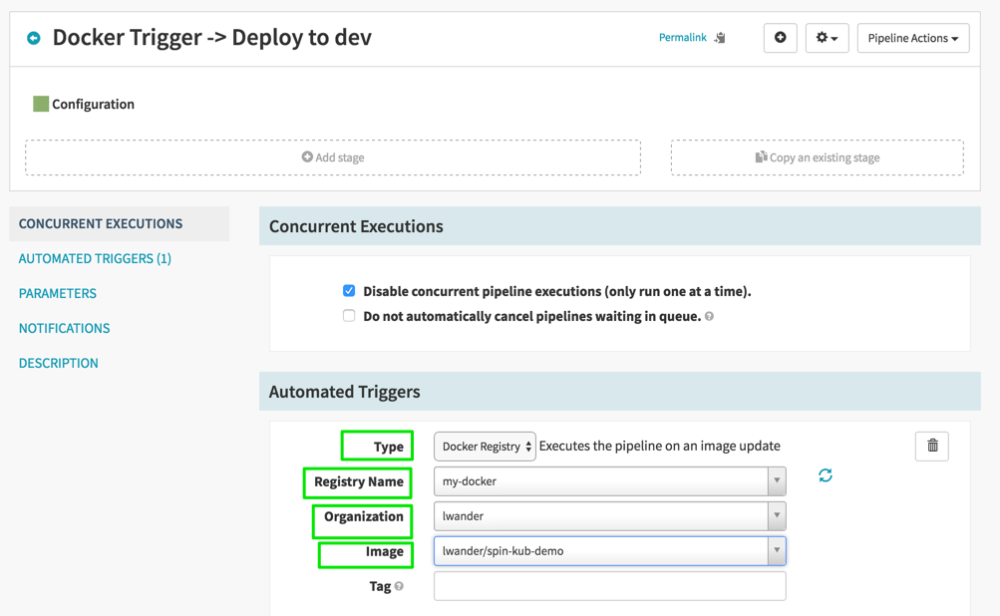

Now select _Add Stage_ just below _Configuration_, and fill out the form as follows:

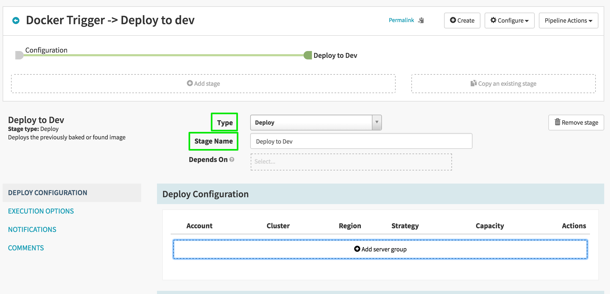

Next, in the _Server Groups_ box select _Add Server Group_, where you will use the already deployed server group as a template like so:


In the resulting dialog, we only need to make one change down in the _Container_ subsection. Select the image that will come from the Docker trigger as shown below:

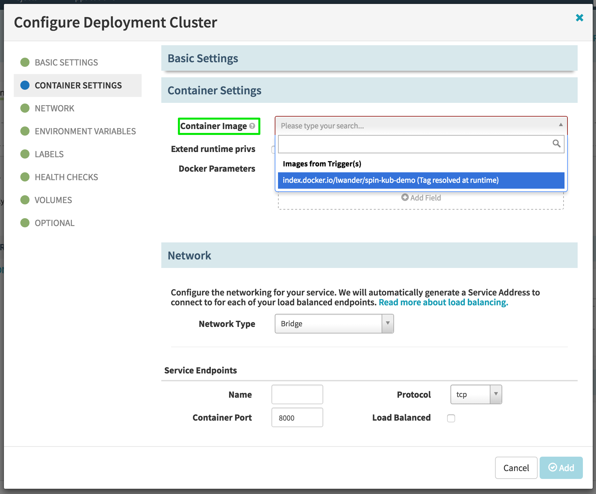

Lastly, we want to add a stage to destroy the previous server group in this _dev_ cluster. Select _Add Stage_, and fill out the form as follows:


# 4. Verification Pipeline

Back on the _Pipelines_ dialog, create a new pipeline as before, but call it "Manual Judgement". On the first screen, add a Pipeline trigger as shown below:

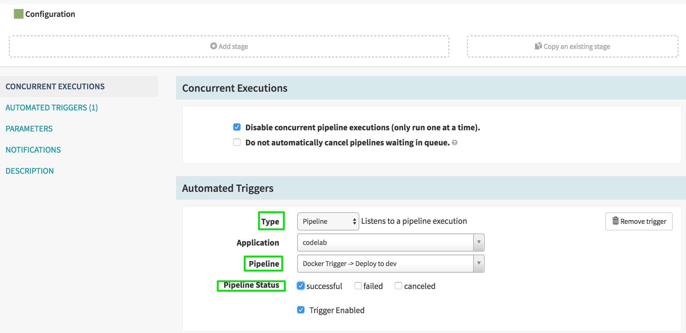

We will only add a single stage, which will serve to gate access to the _prod_ environment down the line. The configuration is shown here:

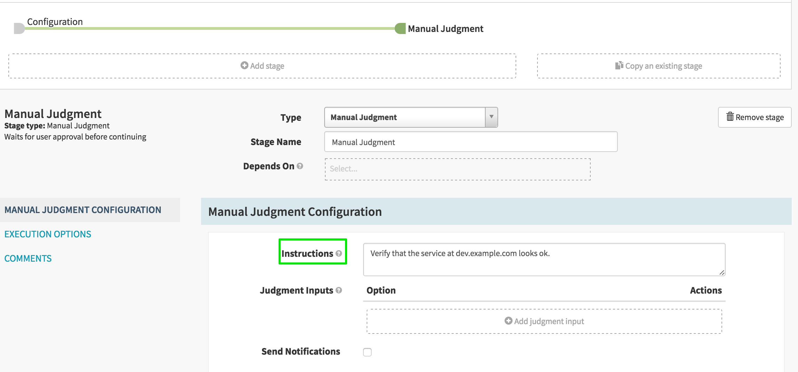

Keep in mind, more advanced types of verification can be done here, such as running a DC/OS batch job to verify that your app is healthy, or calling out to an external Jenkins server. For the sake of simplicity we will keep this as "manual judgement".

# 5. Promote to _prod_

Create a new pipeline titled "Deploy to Prod", and configure a pipeline trigger as shown here:

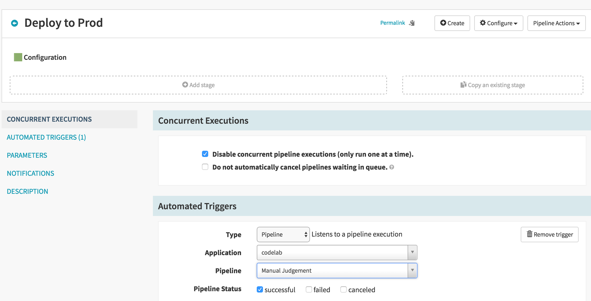

Now we need to find the deployed image in _dev_ that we previously verified. Add a new stage and configure it as follows:

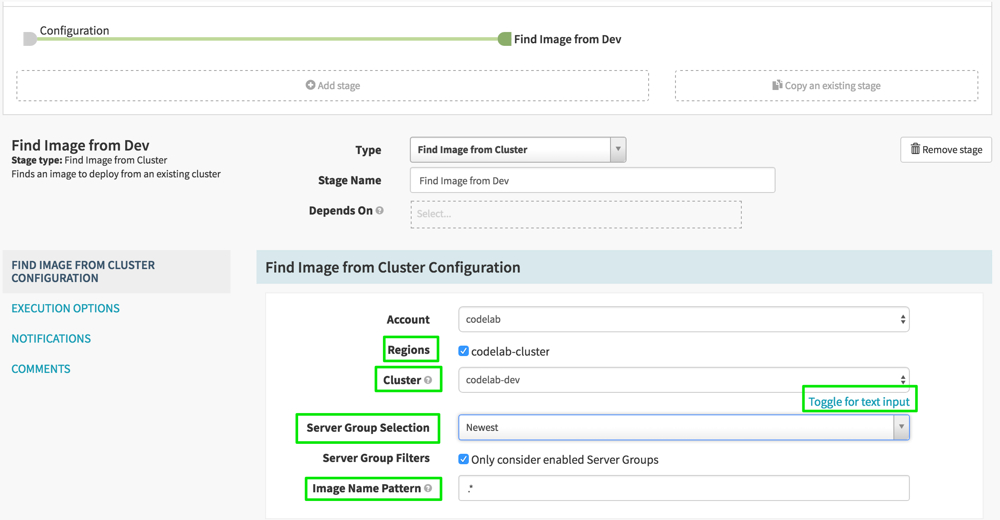

Now, to deploy that resolved image, add a new stage and configure it as follows.

Select _Add Server Group_, and again use the _dev_ deployment as a template:


This time we need to make three changes to the template. First, change the "stack" to represent our _prod_ cluster:

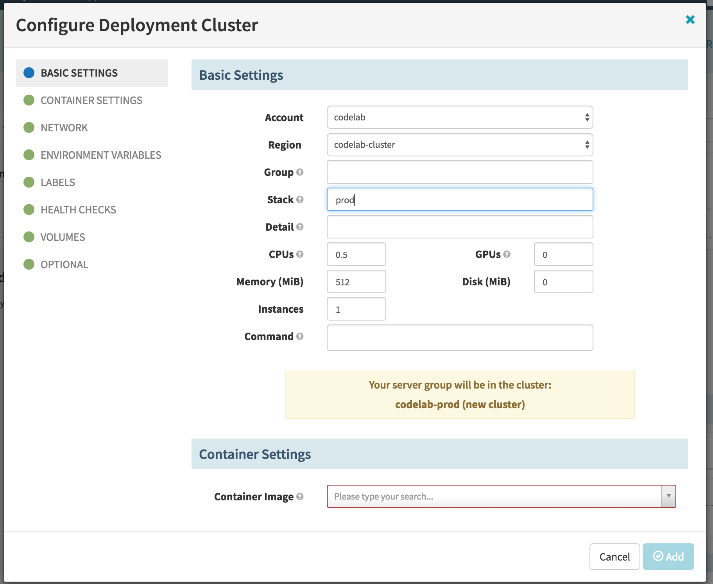

Next in the container section:


Lastly in the labels section:

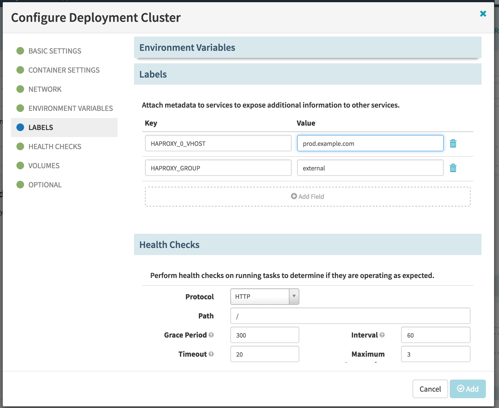

Now to prevent all prior versions of this app in production from serving traffic once the deploy finishes, we will add a "Disable Cluster" stage like so:

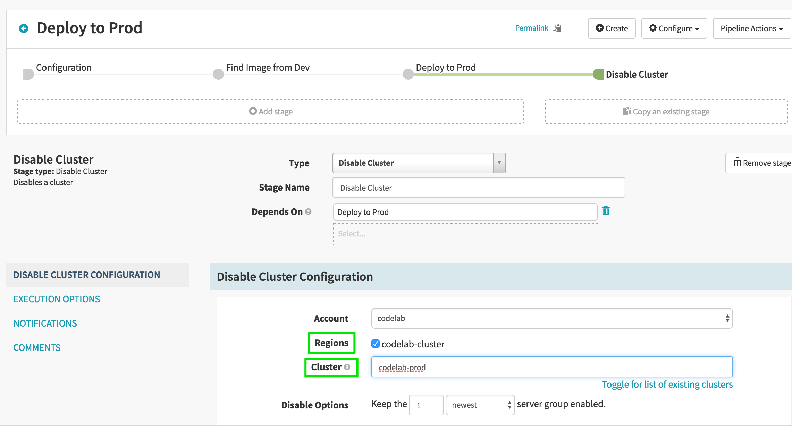

Save the pipeline, and we are ready to go!

# 7. Run the Pipeline

Push a new branch to your repo, and wait for the pipeline to run.

<code>NEW_VERSION=v1.0.0
 git checkout -b $NEW_VERSION
 git push origin $NEW_VERSION</code>

Once the Manual Judgement stage is hit, use `curl` to "verify" your deployment.

```bash
curl --header "Host: dev.example.com" http://$PUBLIC_AGENT
```

Hit _continue_ once you are ready to promote to _prod_.

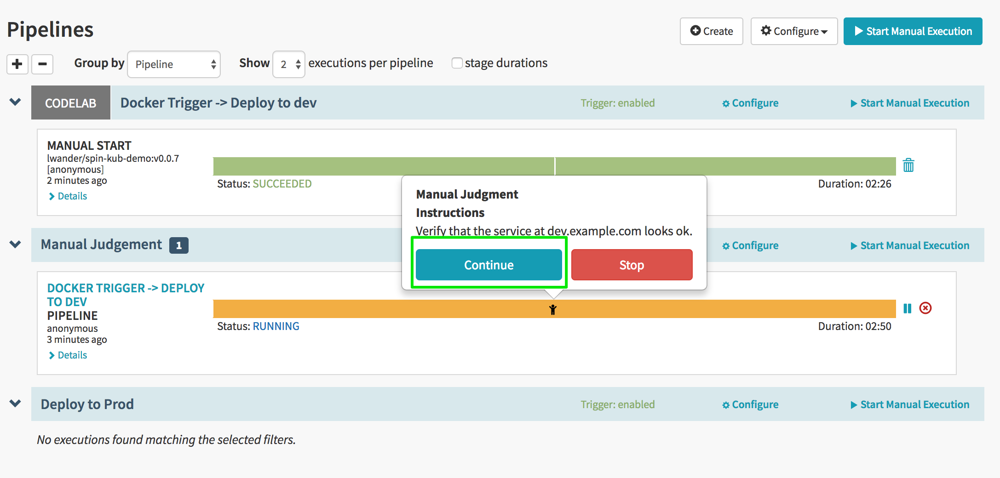

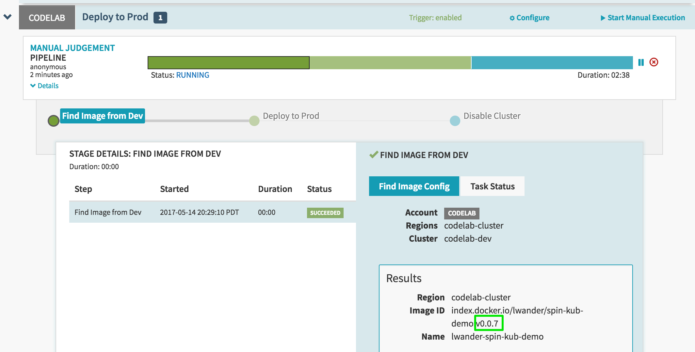

To verify, use `curl` again:

```bash
curl --header "Host: prod.example.com" http://$PUBLIC_AGENT
```

Once the pipelines are done, you can see the dev and prod stacks in the _Clusters_ tab:


# Further reading

* TODO
